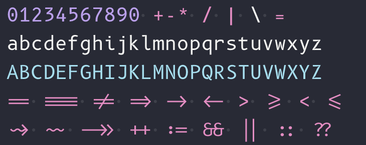
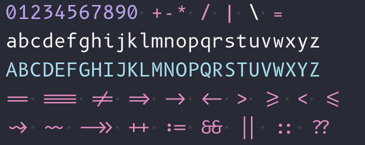
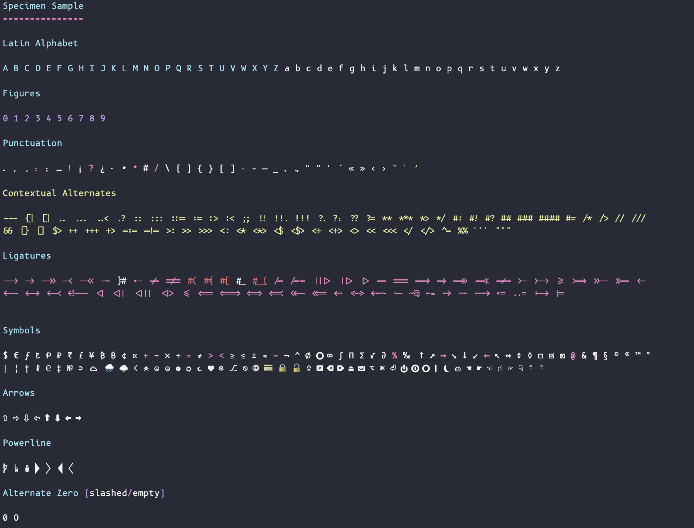
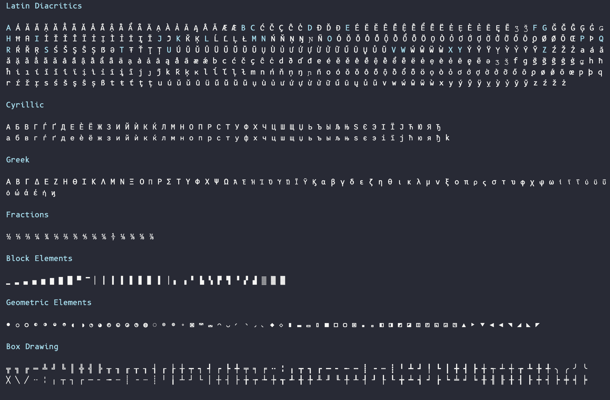

# PolarSys B612 font family

B612 is an highly legible open source font family designed and tested to be used on aircraft cockpit screens.

Main characteristics are:

- Maximize the distance between the forms of the characters
- Respect the primitives of the different letters
- Harmonize the forms and their spacing

## Customizations

The **Mono** fonts were edited with FontLab to add dotted-zero and slashed-zero sources (vfc and ufo formats). Also the fonts had Ligatures and Nerd Fonts glyphs allowing use on terminals and editors.




Some options can be configured via Opentype features:

- Contextual Alternates and Ligatures can be enabled or disabled with `"'calt' on"` / `"'calt' off"` or `"editor.fontLigatures: true"`.
- Slashed Zero can be enabled with `"'zero' on"`
- Empty Zero can be enabled with `"'ezer' on"`

For example on VSCode, to have ligatures and contextual alternates enabled and keep using the dotted zero, set:

```javascript
"editor.fontLigatures": true
// or
"editor.fontLigatures": "'calt' on,'zero' off, 'ezer' off",
// or to have ligatures and slashed zero, set:
"editor.fontLigatures": "'calt' on,'zero' on",
// or to have ligatures and empty zero, set:
"editor.fontLigatures": "'calt' on,'ezer' on",
```

The fonts were Ligaturized using <https://github.com/ToxicFrog/Ligaturizer>. The ligatures come from Fira Code font originally.

Nerd Fonts glyphs were added to the fonts using Docker container from <https://github.com/ryanoasis/nerd-fonts/>.

The modified fonts can be downloaded from [./fonts/](./fonts/) directory.

- `fonts/ligatures` - Contains both the B612 and B612 Mono fonts with ligatures.
- `fonts/ligature-nerd` - Contains the B612 and B612 Mono fonts with NerdFonts glyphs and ligatures.
- `fonts/original` - Contains the original B612 and B612 Mono fonts without any modifications (no ligatures or NerdFonts glyphs) and no dotted/slashed zero sources (original empty zero).
- `fonts/plain` - Contains the original B612 and B612 Mono fonts with dotted and slashed zero sources.

## Font Specimen

Below the font Specimen containing the standard alphabet, punctuation and symbols including the default enabled ligatures:



Below additional scripts, blocks and drawing elements:



## Building or Updating the fonts

To build a new version of the font, edit it with FontLab if required, then run the "Export Font As" option, selecting "UFO Package" format and below the format, select all fonts to be exported. Than export again in the same menu but selecting "OpenType PS (.otf)" format to generate the output fonts in the `fonts` directory.

To add ligatures to the fonts, use Ligaturizer tool. First clone the repository and install the dependencies:

```bash
git clone https://github.com/ToxicFrog/Ligaturizer
cd Ligaturizer
git submodule update --init --recursive
# copy the fonts to be processed to the fonts directory
mkdir fonts/B612
mkdir fonts/B612Mono
cp /path/to/B612/fonts/otf/*.otf fonts/B612
```

Edit the `Ligaturizer.py` file to disable some ligatures if needed (like the `/*` and `*/` which looks wrong on some code). Then edit `build.py` to comment fonts which do not need edit and  Also ligaturizer requires `fontforge` which can be installed with `brew install fontforge`.

Then run the following command:

```bash
make
```

To add the Nerd Fonts glyphs, go to the `fonts` directory which contains the otf files, create an `output` then run the following command (requires Docker or Podman):

```bash
docker run -v $(pwd):/in -v $(pwd)/output:/out nerdfonts/patcher -c
```

The patched fonts will be available in the `output` directory. Move them to the `fonts` directory and delete the `output` directories.

Finally to fix the digital signature of the fonts, run the `build.sh` script from the `scripts` directory:

```bash
./scripts/build.sh
```

## The genesis of PolarSys B612

In 2010, Airbus initiated a research collaboration with [ENAC](http://www.enac.fr) and [Université de Toulouse III](http://www.univ-tlse3.fr/) on a prospective study to define and validate an “Aeronautical Font”: the challenge was to improve the display of information on the cockpit screens, in particular in terms of legibility and comfort of reading, and to optimize the overall homogeneity of the cockpit.

2 years later, [Airbus](https://www.airbus.com) came to find [Intactile DESIGN](https://intactile.com) to work on the design of the eight typographic variants of the font. This one, baptized B612 in reference to the imaginary asteroid of the aviator Saint‑Exupéry, benefited from a complete hinting on all the characters.

## Releasing a new version of the font

- Update the version number in the font info of the source files
- Make a copy of the source files
- Open the copies in Fontlab
- Run the merge intersection command on each file
- Generate the ttf files
- Run the build script from the scripts folder to fix digital signature

## Copyright

Copyright (c) 2012, AIRBUS (airbus-group.com). All rights reserved.

## License

This program and the accompanying materials are made available under the terms of the Eclipse Public License v2.0 and Eclipse Distribution License v1.0 and the SIL Open Font License v1.1 which accompanies this distribution. The Eclipse Public License is available at [https://www.eclipse.org/legal/epl-v20.html](https://www.eclipse.org/legal/epl-v20.html) and the Eclipse Distribution License is available at [https://www.eclipse.org/org/documents/edl-v10.php](https://www.eclipse.org/org/documents/edl-v10.php). The SIL Open Font License v1.1 is available at [https://scripts.sil.org/OFL](https://scripts.sil.org/OFL)
